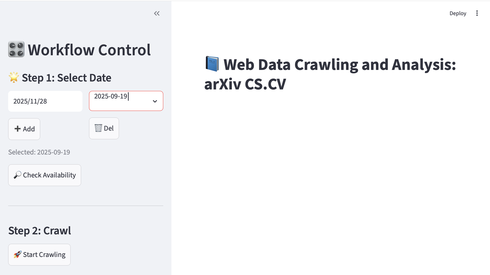
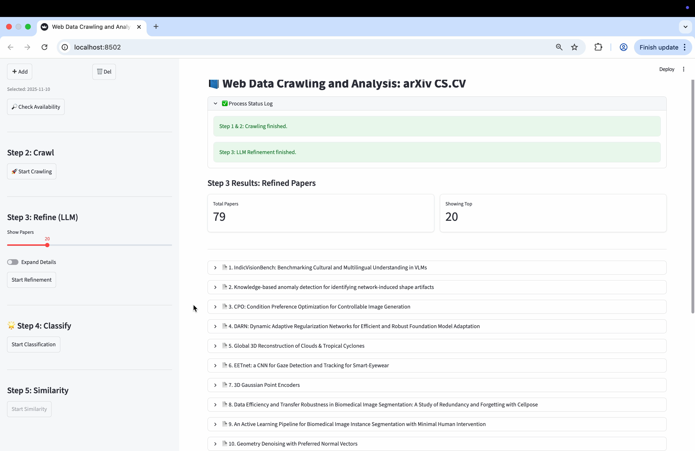
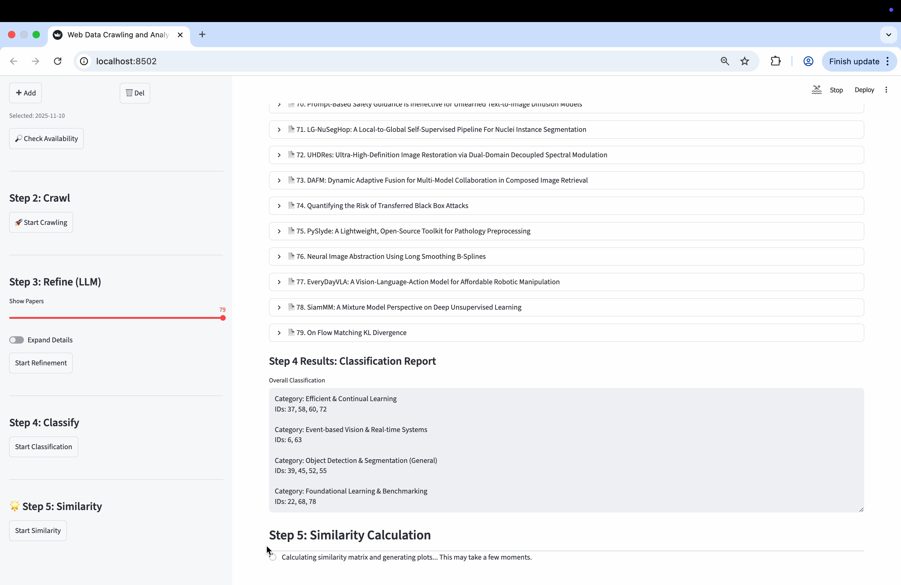
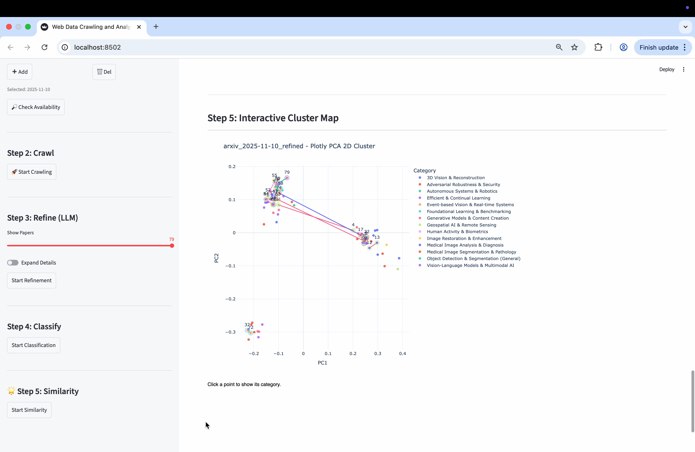
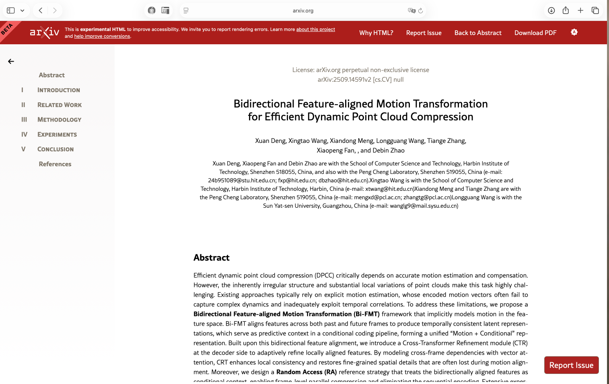

# Interactive Streamlit-Based Platform for Academic Paper Crawling and Visual Analytics

This project implements an interactive Streamlit-based platform for web data crawling and analysis of academic papers, using arXiv Computer Vision (cs.CV) daily updates as a representative example. The system automatically crawls key information from arXiv “catch-up” pages for user-specified dates, including paper titles, abstracts, authors, and affiliations, and then applies large language models (LLMs) to generate concise task descriptions for each paper.

Here is the structure

```txt
./                                    # Repository root
├── back_end/                         # Core backend logic
│   ├── __pycache__/                  # Python bytecode cache
│   ├── .env                          # Environment variables (e.g., API keys)
│   ├── classify.py                   # Paper classification module
│   ├── constants.py                  # Global constants and common configuration
│   ├── crawl.py                      # arXiv crawling script
│   ├── dataprocess.py                # Data preprocessing and cleaning
│   └── similarity_calculate.py       # Similarity computation and clustering
│
├── crawl_data/                       # Crawled data and intermediate files
│   └── dates.txt                     # List of dates to be crawled
│
├── readme.md                         # Project documentation
├── requirement.txt                   # Python dependencies
└── ui.py                             # Streamlit UI entry point

```

## 1.Project Execution Procedure

### 1. Prerequisites and Environment Setup

1. Navigate to the repository root directory in the terminal:

   ```bash
   cd /path/to/ArXivInsight
   ```

2. (Optional but recommended) Create and activate a virtual environment:

   ```bash
   python -m venv venv
   source venv/bin/activate   # On Windows: venv\Scripts\activate
   ```

3. Install all Python dependencies specified in `requirement.txt`:

   ```bash
   pip install -r requirement.txt
   ```

------

### 2. Configure Model API Credentials

1. In the `back_end/` directory, locate the `.env` file.

2. Edit `.env` and fill in your own API configuration, for example:

   ```env
   API_BASE_URL=https://your-api-endpoint
   API_KEY=your_api_key_here
   ```

3. Save the file. The backend modules will read these variables at runtime.

------

### 3. Start the Streamlit Application

1. Ensure you are still in the repository root directory.

2. Launch the user interface with Streamlit:

   ```bash
   streamlit run ui.py
   ```

3. After the command is executed successfully, open the URL shown in the terminal (typically `http://localhost:8501`) in a web browser to access the interactive paper analysis system.

### 2.Main Interface Overview

The figure below shows the **main user interface** of the system.
The layout is divided into two functional panels:

- **Left Panel – Operation / Control Area**
  - Used to configure and trigger the workflow.
  - Typical functions include:
    - Selecting or editing the crawl dates.
    - Starting the arXiv crawling task.
    - Running data cleaning and refinement.
    - Invoking the large-language-model–based classification.
    - Launching the similarity analysis and clustering steps.
  - Each step is exposed as clearly labeled buttons, checkboxes, or input fields so that users can execute the pipeline in a guided, step-by-step manner.
- **Right Panel – Visualization Area**
  - Used to display the results corresponding to the operations on the left.
  - Main contents include:
    - Execution logs and status messages for each processing step.
    - Tabular views of the crawled and processed paper lists.
    - Interactive charts (e.g., similarity scatter plots, clustering views) that support zooming, hovering and, where applicable, clicking to open the original arXiv page.

Together, the two panels provide an integrated environment where users can **control the full processing pipeline on the left** and **immediately inspect quantitative and visual analysis results on the right**.



### 3. Operational Workflow

The system follows a four–stage workflow from data acquisition to visualization:

1. **Date Selection and Web Crawling**
   The user first specifies one or more target dates in the left-hand control panel (or via the `dates.txt` configuration file). Based on these inputs, the crawler automatically constructs the corresponding arXiv URLs, retrieves the HTML pages for the selected dates, and stores the raw metadata (titles, authors, abstracts, links, etc.) in structured files under the `crawl_data/` directory.

   

2. **Large-Language-Model–Assisted Data Preprocessing**
   In the second stage, a large language model (LLM) is invoked to assist with data cleaning and normalization. The raw records are parsed, incomplete or duplicated entries are filtered, and textual fields are standardized. When necessary, the LLM is further used to generate concise summaries, refine noisy abstracts, and extract salient keywords, thereby producing a high-quality preprocessed corpus suitable for downstream analysis.

   

3. **LLM-Based Coarse Topic Classification**
   The preprocessed papers are then passed to the LLM for coarse-grained topic categorization. Using a carefully designed prompt schema, each paper (title plus abstract) is mapped to one or several high-level research themes (e.g., 3D vision, object detection, generative modeling). The resulting category labels are written back to the processed dataset and serve both as descriptive tags and as an initial partition of the corpus.

   

4. **Similarity Computation, Fine-Grained Grouping, and Visualization**
   In the final stage, the system computes pairwise semantic similarities between papers, typically by encoding texts into vector embeddings and applying cosine similarity. These similarity scores are used to perform fine-grained grouping or clustering of the papers. Dimensionality-reduction techniques (such as PCA) are then applied to project the embeddings into a two-dimensional space, which is rendered on the right-hand visualization panel as an interactive scatter plot. Users can visually inspect topical clusters, explore local neighborhoods of related papers, and, where supported, click individual points to open the corresponding arXiv pages in a browser.

   

   

